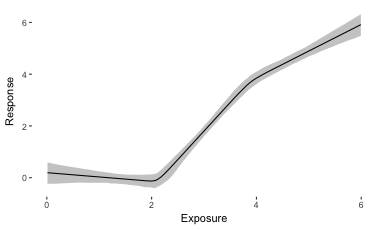
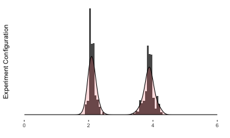
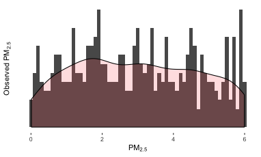
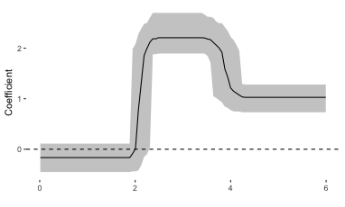
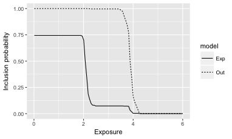

# LERCA

Local Exposure Response Confounding Adjustment R package.

## Installing LERCA

Installing and using LERCA in Rstudio is straightforward. You will first need the ```devtools``` R package.

```
install.packages('devtools')
library(devtools)
devtools::install_github("gpapadog/DAPSm")
```

## LERCA example

### Generating data

In order to generate data with local confounding you can use the ```SimDifferentialConfounding``` function. Below is the code that one could use to generate the toyData used throughout the examples on this R package.

This specific data set has three true experiments with four potential confounders. In experiment 1, C<sub>1</sub> is a confounder, in experiment 2, C<sub>1</sub> and C<sub>3</sub> are confounders, and in experiment 3, C<sub>3</sub> is a confounder.

```
library(LERCA)
set.seed(1234)

N <- 400  # Sample size.
num_exper <- 3  # Number of experiments.
num_conf <- 4  # Number of potential confounders.

# Correlation of covariates with the exposure in each experiment.
XCcorr <- matrix(NA, nrow = num_conf, ncol = num_exper)
XCcorr[1, ] <- c(0.3, 0.2, 0)
XCcorr[2, ] <- c(0.3, 0, 0)
XCcorr[3, ] <- c(0, 0.2, 0.4)
XCcorr[4, ] <- c(0, 0, 0)

# Covariates' outcome model coefficients.
out_coef <- matrix(NA, nrow = num_conf, ncol = num_exper)
out_coef[1, ] <- c(0.5, 0.6, 0)
out_coef[2, ] <- c(0, 0, 0)
out_coef[3, ] <- c(0, 0.6, 0.4)
out_coef[4, ] <- c(0.3, 0.3, 0.3)

varC <- rep(1, num_conf)

# Exposure range and true experiment configuration.
Xrange <- c(0, 6)
exper_change <- c(0, 2, 4, 6)

# True coefficients of exposure in each experiment.
bYX <- c(0, 2, 1)

toyData <- SimDifferentialConfounding(N = N, num_exper = num_exper,
                                      XCcorr = XCcorr, out_coef = out_coef,
                                      varC = varC, Xrange = Xrange,
                                      exper_change = exper_change, bYX = bYX)
toyData <- toyData$data
```

### Fitting LERCA on the toy data set.

First we fit LERCA on the data set. All we need is to set the MCMC specifications and to tell the function which columns correspond to the covariates that are potential confounders. We also need to set the number of points in the experiment configuration.

```
# MCMC specifications like number of chains and posterior samples.
chains <- 3
Nsims <- 4000
K <- 2  # Number of points in the experiment configuration.

# Which columns of the data set correspond to covariates.
cov_cols <- which(names(toyData) %in% paste0('C', 1 : num_conf))
omega <- 5000

lerca <- LERCA(dta = toyData, chains = chains, Nsims = Nsims, K = K,
               cov_cols = cov_cols, omega = omega)
```

We can burn and thin the sample:

```
burn <- 2000
thin <- 10
lerca_short <- BurnThin(lerca = lerca, burn = burn, thin = thin)
```

### Choosing the value of K based on the WAIC.

Based on these posterior samples, we can get the model's WAIC.
```
waic <- WAIC(lerca = lerca_short, dta = toyData)
```
which returns
```
     lppd    pwaic1    pwaic2     waic1     waic2 
-2591.381  1401.320  2265.188  7985.402  9713.137 
```
the log posterior predictive density, the penalty based on the two definitions and the corresponding WAIC based on the two penalty definitions.

This can be compared to the WAIC for a model with _K =3_.
```
lerca2 <- LERCA(dta = toyData, chains = chains, Nsims = Nsims, K = 3,
               cov_cols = cov_cols, omega = omega)
lerca_short2 <- BurnThin(lerca = lerca2, burn = burn, thin = thin)
waic2 <- WAIC(lerca = lerca_short2, dta = toyData)
> waic2
     lppd    pwaic1    pwaic2     waic1     waic2 
-2467.785  1775.760  3503.118  8487.090 11941.808 
```
We can easily see that LERCA with _K=3_ has higher WAIC for both definitions of the penalty. Therefore, _K=2_ would be preferred.

### Visualizing the results.

In order to easily visualize the results the package includes the following functions:
```
# Get the ER estimates over a set of exposure values.
ER <- GetER(dta = toyData, cutoffs = lerca_short$cutoffs,
            coefs = lerca_short$coefs[2, , , , ], mean_only = TRUE)
            
# Acquire the inclusion probabilities as a function of the exposure for both models.
inclusion <- ExposureInclusion(lerca = lerca_short, exp_values = ER$x)

# Acquire the coefficients as a function of the exposure.
coefs <- ExposureCoefs(lerca = lerca_short, exp_values = ER$x)
```
The last one is particularly useful for acquiring the coefficient of the exposure in the outcome model which corresponds to the causal quantity of interest.

The inclusion probabilities are the ones to be used to understand which covariates are important at different exposure levels.

Results can be easily plotted using the function provided:
```
probs <- c(0.1, 0.9)
plots <- PlotLERCA(dta = toyData, lerca = lerca_short, ER = ER, probs = probs,
                   coefs = coefs, inclusion = inclusion, variable = 3,
                   wh_model = 2)
```
Plots produced using this function include the estimated ER, the posterior distribution of the experiment configuration, the observed exposures distribution, the posterior distribution of a variable's coefficient as a function of the exposure, and if that variable is a covariate, the posterior inclusion probability of that variable in the exposure and outcome models.





Coefficient of the exposure in the outcome model.



Posterior inclusion probability of C<sub>1</sub>.




## Functions

- BurnThin: Function that performs burning and thinning of the MCMC chains.

- GenYgivenXC: Function that generates the outcome given exposure and covariates.

- GetbYvalues: Getting the intercepts of the outcome models for each experiment ensuring a continuous ER.

- GetER_1chain: Using the posterior samples of one chain to acquire samples of the mean ER.

- GetER: Calling GetER_1chain for each chain to aquire posterior samples of the mean ER for all chains.

- JumpOver: Performing the jump over move for the update of the experiment configuration and inclusion indicators.

- JumpWithin: Performing the jump within move for the update of the experiment configuration and inclusion indicators.

- **LERCA**: The central function of the package. Function to fit LERCA to the data.

- LogLike: Function that calculates the log likelihood of the data.

- MakeArrays: Function that creates arrays where the LERCA results are saved.

- psr: Function that calculates the PSR based on the mean ER posterior samples.

- SimDifferentialConfounding: Function that generates data with differential confounding.

- TrueER: Function that calculates the true mean ER.

- UpdateAlphas: Function that updates the inclusion indicators.

- UpdateCoefficients: Function that updates all coefficients but intercepts of the outcome model and the coefficient of exposure in the outcome model.

- UpdateExperiments: Function that updates the experiment configuration when the update is separate from the update of the inclusion indicators.

- UpdateVariances: Function that updates the residual variances.

- WAIC: Function that calculates the WAIC of the LERCA fit.

- XCcontinuous: Function that ensures that the mean exposure-covariates relationship is continuous.


